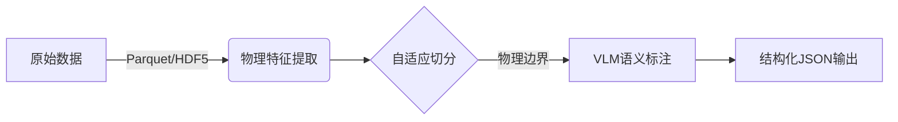

# Robo-ETL (robo-auto-annation)
**物理驱动 + AI语义的具身智能数据集自动化标注流水线**

## Key Features
✅ **物理自适应轨迹切分**  
- 融合 Pelt 变点检测与轻量级 LSTM 的两阶段切分算法  
- 动态计算 Penalty 项（基于物理特征方差）与 Threshold（基于动作幅度）

✅ **智能参数系统**  
- 自适应调整切分参数，支持从微小操作到大范围移动的全场景标注

✅ **语义标注流水线**  
- 集成 VLM（支持 GPT-4o/Gemini）进行因果意图分析  
- 输出结构化动作语义标签（动词-对象-属性三元组）

✅ **多协议支持**  
- 原生兼容 LeRobot, MCAP/ROS, HDF5 等机器人数据集格式

## Architecture


## Configuration
核心参数在 `configs/robot_config.yaml` 中定义：
```yaml
kinematics:
  fps: 30                 # 动态帧采样率（自动调整）
segmentation:
  adaptive: true          # 启用自适应切分算法
  min_segment: 15         # 最小动作片段帧数
vlm:
  model: qwen-vl-max           # 默认VLM模型
  api_key: YOUR_API_KEY   # API密钥配置
```

## Quick Start
```bash
# 依赖安装
uv sync

# 基础运行
# 配置APIkey
export DASHSCOPE_API_KEY=xxxxx
python main.py 
```

## Technical Highlights
### 物理特征驱动的自适应切分
1. **动态惩罚项计算**  
   基于位置/旋转/夹爪状态的方差计算动态 Penalty：
   ```python
   penalty = base_penalty * (1 + σ_position + σ_rotation + σ_gripper)
   ```

2. **15帧保底采样逻辑**  
   确保每个标注片段满足VLM最小上下文需求：
   ```python
   if segment_frames < 15:
       expand_window(Δt=15 - segment_frames)
   ```

### 数据流处理阶段
1. **物理特征提取**  
   计算加速度、角速度、夹爪状态变化率等运动学特征

2. **两阶段切分**  
   - Pelt 预切分：快速识别明显动作边界  
   - LSTM 精修：处理模糊过渡场景

3. **语义标注**  
   通过 VLM 解析动作序列的因果关系，输出结构化意图描述

---

**Project maintained by:** [Xu Runtian](https://github.com/XuRuntian)  
**License:** MIT